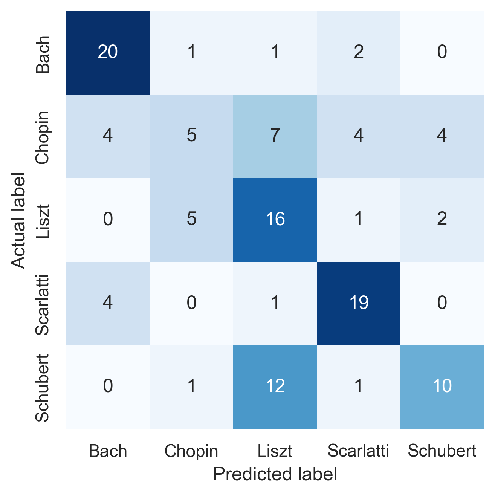

# ClassicalNN

I tested out making a neural network (NN) in preparation for my masters project. An interesting idea I came up with is to make a NN which classifies midi files based on which classical composer wrote them. 

This is a walkthrough of what I did to accomplish this task. You can follow along to create your own NN based on your needs.

> I mostly followed [this tutorial](https://github.com/jeffprosise/Deep-Learning/blob/master/Audio%20Classification%20(CNN).ipynb)

### Requirements

- Python 3.12
- A classical midi dataset
    - I used [GiantMIDI-Piano](https://github.com/bytedance/GiantMIDI-Piano/blob/master/disclaimer.md)
- [FluidSynth](https://www.fluidsynth.org)
    - You can install it with `choco install fluidsynth`
- A soundfont
    - I used [FluidR3_GM](https://member.keymusician.com/Member/FluidR3_GM/index.html)

## Part 1 (installation)

- Clone this repository
- Download a classical midi dataset and place it into the repository
- Install pipenv if you haven't already
    - `pip install pipenv`

Make sure you are in the repository directory and run `pipenv install`. This will create a virtual environment and install all the required packages and their dependencies (check the Pipfile for a list)

Enter the virtual environment with `pipenv shell`.

## Step 2 (rename.py)

The midi files in your dataset can sometimes contain non-ASCII characters which some functions struggle to read.

> Example filename : `Chopin, Frédéric, Études, Op.10, g0hoN6_HDVU.mid`

The `unidecode` function from the `unidecode` package converts these non-ASCII characters back into ASCII.

```cmd
>>> from unidecode import unidecode
>>> unidecode("Chopin, Frédéric, Études, Op.10, g0hoN6_HDVU.mid")
'Chopin, Frederic, Etudes, Op.10, g0hoN6_HDVU.mid'
```

The following code renames all of the files in the midi dataset with this `unidecode` function.


```python
import os
from unidecode import unidecode

directory = "..\\midis"

name = os.listdir(directory)
newname = list(map(unidecode, name))

for n, nn in zip(name, newname):
    old = os.path.join(directory, n)
    new = os.path.join(directory, nn)
    os.rename(old, new)
```

## Step 3 (csv123.py)

The following code creates a csv file with 2 columns, the midi filepath, and the composer. We'll use this csv file to filter and select for midi files to use in the NN.

```python
import os
import polars as pl

directory = "..\\midis"

def extract_composer(filename):
    return filename.split(',')[0].strip() + ", " + filename.split(',')[1].strip()

file_paths = [os.path.join(directory, f) for f in os.listdir(directory)]
composers = list(map(extract_composer, os.listdir(directory)))

data = {
    "file_paths": file_paths,
    "composers": composers
}

df = pl.DataFrame(data)
df.write_csv("..\\mididata.csv")
```

## Step 4 (filter.py)

I decided to select our midis from the 5 most abundant classical composers in the dataset.

The following code gives me those 5 composers

```python
import polars as pl
from pretty_midi import PrettyMIDI

df = pl.read_csv("..\\mididata.csv")

composer_counts = df.group_by("composers").agg(
    pl.col("file_paths").count().alias("counts")
)

print(composer_counts.sort(by="counts", descending=True).head(5))
```

Here is the output :

```
┌────────────────────────┬────────┐
│ composers              ┆ counts │
│ ---                    ┆ ---    │
│ str                    ┆ u32    │
╞════════════════════════╪════════╡
│ Liszt, Franz           ┆ 141    │
│ Scarlatti, Domenico    ┆ 140    │
│ Bach, Johann Sebastian ┆ 129    │
│ Schubert, Franz        ┆ 96     │
│ Chopin, Frederic       ┆ 96     │
└────────────────────────┴────────┘
```

The 5 most abundant composers are Liszt, Scarlatti, Bach, Schubert, and Chopin. 

I figured taking 80 midi files from each of them would be a good amount to work with. We're only taking 30 second clips from each midi so we also want to make sure that the duration of the midi is at least 30 seconds long. 

The following code creates a new csv file based on these filters.


```python
composers_of_interest = ['Liszt, Franz', 'Scarlatti, Domenico', 'Bach, Johann Sebastian', 'Schubert, Franz', 'Chopin, Frederic']

# A function which returns the midi duration in seconds, given a file_path
def duration(file_path) : 
    midi = PrettyMIDI(file_path)
    return midi.get_end_time()

result_df = (
    df
    .filter(pl.col('composers').is_in(composers_of_interest))
    .with_columns(pl.col('file_paths').map_elements(duration).alias("durations"))
    .filter(pl.col('durations')>=30)
    .sort(by=["composers", "durations"])
    .group_by('composers').head(80)
)

result_df.write_csv('..\\filtered.csv')
```

## Step 5 (towav.py)

Image classification with NNs has been studied extensively and can be implemented easily. Rather than building a NN specifically for midi files, we can simply convert them to a [spectrogram](https://en.wikipedia.org/wiki/Spectrogram) and apply our existing tools for image classification. 

I couldn't find a direct way to turn a midi to a spectrogram, so we'll have to convert them into wav files first.

Some of the midis are silent for up to 10 or so seconds before beginning. We address this problem by detecting silent regions in the wav file and trimming it to begin on the first instance a sound is detected. We then take the first 30 seconds of the trimmed wav file.

The following code performs this task

> **Warning.** If you encounter an error, try creating a folder called "wavs" in the root directory. Also, this will take a **really** long time.

```python
import os
import polars as pl
from midi2audio import FluidSynth
from pydub import AudioSegment
from pydub.silence import detect_nonsilent

fs = FluidSynth("file/path/to/soundfont.sf2")
df = pl.read_csv("..\\filtered.csv")

def midi_to_wav_path(midi_path):
    directory, filename = os.path.split(midi_path)
    new_directory = directory.replace('midis', 'wavs', 1)
    new_filename = os.path.splitext(filename)[0] + '.wav'
    wav_path = os.path.join(new_directory, new_filename)
    return wav_path

midis = df["file_paths"].to_list()
wavs = list(map(midi_to_wav_path, midis))

for midi, wav in zip(midis, wavs):
    fs.midi_to_audio(midi, wav)
    audio = AudioSegment.from_wav(wav)
    
    # Detect non-silent parts (returns list of (start, end) tuples in milliseconds)
    non_silent_ranges = detect_nonsilent(audio, min_silence_len=1000, silence_thresh=audio.dBFS-16)
    
    if non_silent_ranges:
        # If non-silent part detected, trim the silence from the start
        start_trim = non_silent_ranges[0][0]
        trimmed_audio = audio[start_trim:]
    else:
        trimmed_audio = audio
    
    trimmed_audio = trimmed_audio[:30000]
    trimmed_audio.export(wav, format="wav")
```

## Step 6 (tospec.py)

Manually sort the newly generated wavs into folders based on their composers. The following code will generate the required spectograms

```python
import numpy as np
import librosa.display, os
import matplotlib.pyplot as plt

def create_spectrogram(audio_file, image_file):
    fig = plt.figure()
    ax = fig.add_subplot(1, 1, 1)
    fig.subplots_adjust(left=0, right=1, bottom=0, top=1)

    y, sr = librosa.load(audio_file)
    ms = librosa.feature.melspectrogram(y=y, sr=sr)
    log_ms = librosa.power_to_db(ms, ref=np.max)
    librosa.display.specshow(log_ms, sr=sr)

    fig.savefig(image_file)
    plt.close(fig)
    
def create_pngs_from_wavs(input_path, output_path):
    if not os.path.exists(output_path):
        os.makedirs(output_path)

    dir = os.listdir(input_path)

    for i, file in enumerate(dir):
        input_file = os.path.join(input_path, file)
        output_file = os.path.join(output_path, file.replace('.wav', '.png'))
        create_spectrogram(input_file, output_file)

create_pngs_from_wavs('../wavs/Schubert', '../spectrograms/Schubert')
create_pngs_from_wavs('../wavs/Liszt', '../spectrograms/Liszt')
create_pngs_from_wavs('../wavs/Bach', '../spectrograms/Bach')
create_pngs_from_wavs('../wavs/Chopin', '../spectrograms/Chopin')
create_pngs_from_wavs('../wavs/Scarlatti', '../spectrograms/Scarlatti')
```

## Step 7 (model.py)

The following code trains a NN on these spectograms. Please refer to [the tutorial](https://github.com/jeffprosise/Deep-Learning/blob/master/Audio%20Classification%20(CNN).ipynb) for further explanation. I only made a few minor changes to the code from there.

```python
import os
import numpy as np
from keras.preprocessing import image

def load_images_from_path(path, label):
    images = []
    labels = []

    for file in os.listdir(path):
        images.append(image.img_to_array(image.load_img(os.path.join(path, file), target_size=(224, 224, 3))))
        labels.append((label))
        
    return images, labels

x = []
y = []

images, labels = load_images_from_path('../spectrograms/Bach', 0)
    
x += images
y += labels

images, labels = load_images_from_path('../spectrograms/Chopin', 1)

x += images
y += labels

images, labels = load_images_from_path('../spectrograms/Liszt', 2)

x += images
y += labels

images, labels = load_images_from_path('../spectrograms/Scarlatti', 3)

x += images
y += labels

images, labels = load_images_from_path('../spectrograms/Schubert', 4)

x += images
y += labels

from tensorflow.keras.utils import to_categorical
from sklearn.model_selection import train_test_split

x_train, x_test, y_train, y_test = train_test_split(x, y, stratify=y, test_size=0.3, random_state=0)

x_train_norm = np.array(x_train) / 255
x_test_norm = np.array(x_test) / 255

y_train_encoded = to_categorical(y_train)
y_test_encoded = to_categorical(y_test)

from tensorflow.keras.applications import MobileNetV2
from tensorflow.keras.applications.mobilenet import preprocess_input
from keras.models import Sequential
from keras.layers import Conv2D, MaxPooling2D
from keras.layers import Flatten, Dense

base_model = MobileNetV2(weights='imagenet', include_top=False, input_shape=(224, 224, 3))

x_train_norm = preprocess_input(np.array(x_train))
x_test_norm = preprocess_input(np.array(x_test))

train_features = base_model.predict(x_train_norm)
test_features = base_model.predict(x_test_norm)

model = Sequential()
model.add(Input(shape=train_features.shape[1:]))
model.add(Flatten())
model.add(Dense(1024, activation='relu'))
model.add(Dense(5, activation='softmax'))
model.compile(optimizer='adam', loss='categorical_crossentropy', metrics=['accuracy'])

hist = model.fit(train_features, y_train_encoded, validation_data=(test_features, y_test_encoded), batch_size=8, epochs=7)

model.save('../ClassicalNN.keras')

from sklearn.metrics import confusion_matrix
import matplotlib.pyplot as plt
import seaborn as sns

sns.set()

y_predicted = model.predict(test_features)
mat = confusion_matrix(y_test_encoded.argmax(axis=1), y_predicted.argmax(axis=1))
class_labels = ['Bach', 'Chopin', 'Liszt', 'Scarlatti', 'Schubert']

sns.heatmap(mat, square=True, annot=True, fmt='d', cbar=False, cmap='Blues',
            xticklabels=class_labels,
            yticklabels=class_labels)

plt.xlabel('Predicted label')
plt.ylabel('Actual label')

plt.savefig('heatmap.png', dpi=300, bbox_inches='tight')
```

The final result is a NN with a 60% prediction accuracy on the validation dataset. Here is the confusion matrix for that result :



Not bad honestly!

